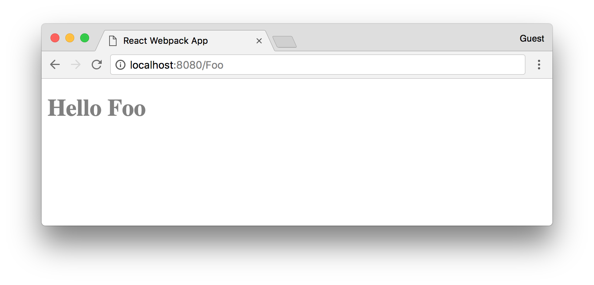

# React Webpack App

The simplest Single-Page Application with React 16 and Webpack 4.

## Installation

* Install [Yarn](https://yarnpkg.com/lang/en/docs/install).

* Install NPM packages:

```
yarn install
```

## Running linters:

```
yarn run lint
```

## Running in development environment

* Start Webpack:

```
yarn run start
```

* Open [localhost:8080](http://localhost:8080/) in browser:


* Try any other URL paths. For example, [localhost:8080/Foo](http://localhost:8080/Foo):



## Building in production environment:

* Compile:

```
yarn run build
```
